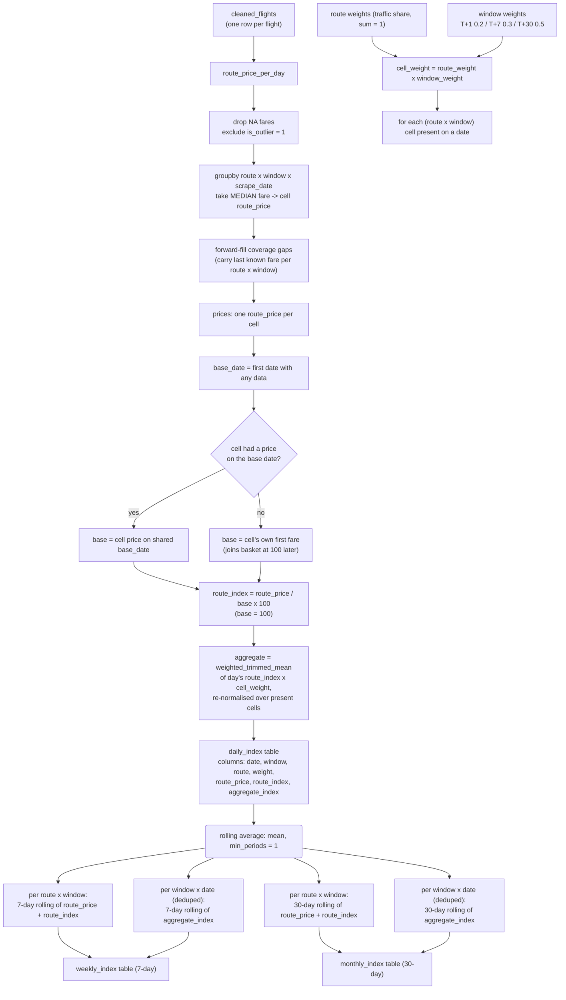

# APIx Indexer — Computation Flowchart



## Same thing in text form

```
cleaned_flights
   │  drop NA fares / outliers
   ▼
median fare per (route × window × day)   ──►   one "cell price"
   │  forward-fill gaps
   ▼
cell price
   │
   ├── base date = first date with data
   ├── cell weight = route weight × window weight   (traffic × booking share)
   │
   ▼
route_index = cell_price / base_price × 100         (each cell starts at 100)
   │
   ▼
daily aggregate_index = weighted trimmed mean        (re-normalised per day)
       of { route_index × cell_weight }
   │
   ▼
daily_index  ──►  7-day rolling means  ──►  weekly_index
   └──────────►  30-day rolling means  ──►  monthly_index
```

## Key formulas

```
route_index(t, r, w) = median_fare(t, r, w) / base_fare(r, w) × 100

cell_weight(r, w)   = route_weight(r) × window_weight(w)

aggregate APIx(t)   = weighted_trimmed_mean(
                          route_index(t, r, w),
                          weights = cell_weight(r, w)
                      )   over cells present on date t

weekly / monthly     = rolling_mean of the above over the last 7 / 30 days
                       (per route for price & index, and on the deduped
                       aggregate headline)
```